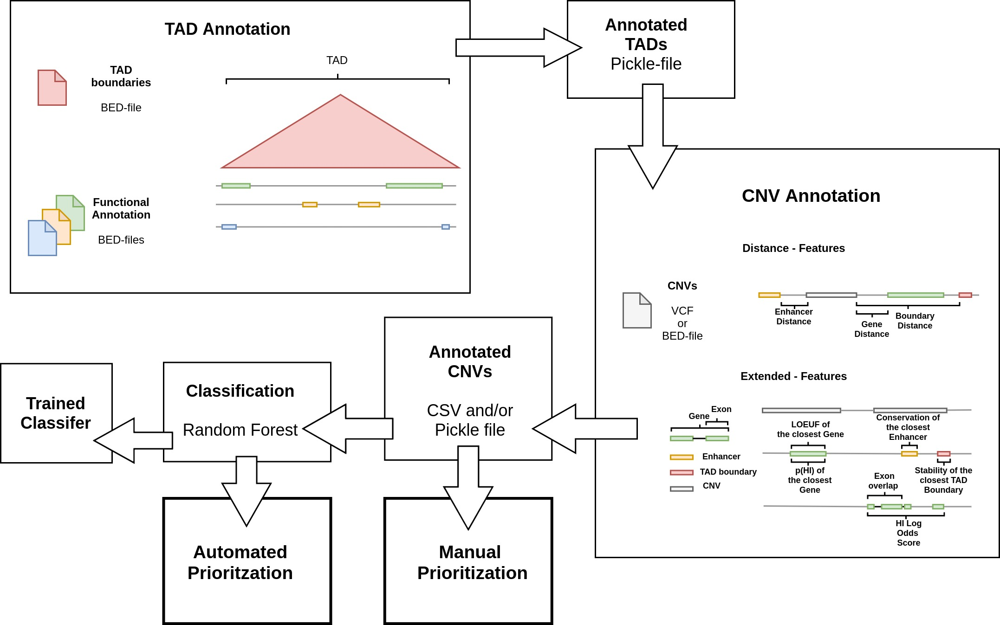

TADA
====

Introduction
------------

The TAD annotation (TADA) tools is designed to annotate CNVs based on functional annotation with respect to their regulatory context i.e. TADs. TADA allows to determine the functional impact of CNVs either by annotation and manual filtering or automated classification. The default Random Forest models are trained on curated sets of pathogenic and non-pathogenic variants. New CNVs can therefore be annotated with the probability of being pathogenic i.e. a *pathogenicity score*. A simplified workflow of TADA is shown in the figure below. Also, a more comprehensive description of TADA including the pretrained model and feature set is provided in our preprint: https://www.biorxiv.org/content/10.1101/2020.06.30.180711v1.

Installation
------------

- Install TADA via GitHub::

     git clone https://github.com/jakob-he/TADA
     python setup.py install

- To ensure a successfull installtion a test protocol can be executed::

      python setup.py test

Usage
-----

There are three use cases for TADA that can be executed using the command line:

	* Annotation of CNVs for manual filtering
	* Prediction of pathogenicity
	* Training a classification model

The basis for all three use cases is a config file containing the paths to the annotations as well as to the BED- or VCF variant files.
We include two default config files *config_del_default.yml* and *config_dup_default* which can be used for deletions and duplications, respectively.
The individual config file entries are described below:

.. code-block:: yaml

    TADS: (In this section the path to BED formatted TAD boundaries is set.)
      RAW: "data/Dixon_2015_stability_formatted_TADs.bed" (By default TAD boundaries called from embryonic stem cells (ES) are used.)
      ANNOTATED: "data/Annotated_Default_TADs.p" (If TADs have been already annotated using the *annotate TADs* command a pickle file containing the preannotated elements can be specified here to speed up CNV annotation. We provide an already annotated set of ES TADs.)

    ANNOTATIONS: (Here, the paths to a variety of annotations are set. Further information on the default set of annotations can be found in our preprint.)
      GENES: "data/gnomad_genes_pli_loeuf_HI.bed"
      EXONS: "data/HAVANA_exon.merged.bed.gz"
      ENHANCERS: "data/fantom5_enhancer_phastcon_average.bed"
      CTCF: "data/H1_hESC_CTCF_peaks_idr_optimal.bed"
      DDG2P: "data/DDG2P_genes.bed"
      POINT: "data/extracted_po_pairs.bed"

    CNVS: (The VCFs or BED variant files are set here. It is required to add descriptor for the individual variant sets. For classification two variants set have to be defined e.g. PATHOGENIC and NON_PATHOGENIC.)
      RAW:
        TEST: (This is an example descriptor and can be adjusted according to the nature of the variants.)
      ANNOTATED: (Similar to TADs preannotated CNVs can be specified here. Again descriptors need the added e.g. TEST.)
        TEST:

    FEATURES: "extended" (The default feature set using the above shown annotation is called "extended", since it includes metrics beyond distance measurements. If the user provides individual annotation this needs to be set to "distance".)

    CLASSIFIER: "rf" (TADA currently only supports a Random Forest as classifier. This might change in future versions.)

    KWARGS: (If "classification_run" was previously executed using the *-gridcv* argument the resulting parameters can be added here to adapt the config file for individually trained models. The current parameter set is optimized for the provided pretrained models.)
      max_depth:  None
      max_features: 'auto'
      min_samples_leaf: 5
      min_samples_split: 4
      n_estimators: 500
      oob_score: True

    PRETRAINED_MODEL: "data/rf_model.p" (A pretrained model can be specified here. By default this points to the provided deletion or duplication model depnding on the config file.)

Annotation of CNVs for Manual Filtering
***************************************

The first use case i.e. annotation of CNVs for manual filtering requires a BED- or VCF-file with CNVs. The path to the CNV needs to specified in the config file. As described above, TADA provides two default config files for deletions and duplications, respectively. The default output of the annotation is a pickled CNV file containing all the annotated CNV objects (*Annotated_CNVs.p*) and a CSV-file where each line refers to an annotated CNV (*Annotated_CNVs.csv*). The annotation is executed as follows:

.. code-block:: python

    general usage: annotate_cnvs [-h] [-p] [-c CONFIG] [-o OUTPUT]

    default: annotate_cnvs -c config_file -o output_directory

Prediction of Pathogenicity
***************************

The process of pathogenicity prediction is similar to the annotation. In a first step, the CNVs passed to the script are annotated. Then a previously defined classification model defined in the config file is used to compute a *pathogenicity score*. This output refers to the probability that the CNV is pathogenic. The score is added to the resulting CSV-file. The default deletion and duplication models are Random Forests trained on curated sets of pathogenic and non-pathogenic variants. However, the user can also specify a different model. It is recommend to train the model using TADA as described below, since it needs to satisfy certain requirements. The recommended way of using the prediction script is:

.. code-block:: python

    general usage: predict_variants [-h] [-c CONFIG] [-o OUTPUT]

    default: predict_variants -c config_file -o output_directory

Training a Classification Model
*******************************

The training of a classification model is an advanced use of TADA. In addition to two sets of CNVs e.g. pathogenic and non-pathogenic, a set of annotations needs to be specified. It is also possible to use the default annotation set. Based on these annotation a feature set is computed. For user defined annotations the features are distances of a CNV to the individual genomic elements. The model can the be trained on the CNVs set with the given feature set as follows:

.. code-block:: python

   general usage: classification_run  [-h] [-c CONFIG] [-fs] [-o OUTPUT] [-gridcv] [-rs RANDOM_SEED]

   default usage: classification_run -c config_file -o output_directory

The *fs* option allows to produce multiple visualizations for feature selection. The visualizations include the permutation based feature importance and a partial correlation based node graph.
If required the classification run can be executed with the *gridcv* option to find an optimal parameter set. For reproducability the *rs* option can be set to a specific integer.
