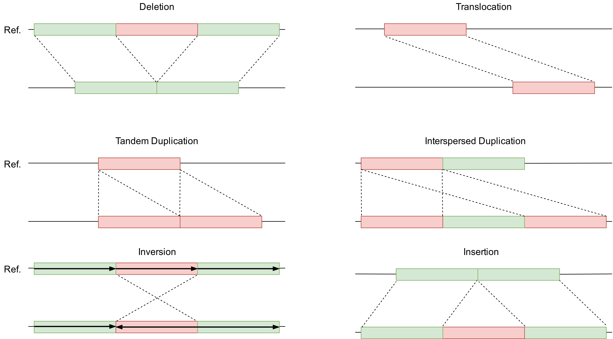

CNVs
====

   SVs consists of Deletions, Translocations, Tandem Duplications, Interspersed Duplications, Inversions and Insertions. TADA has only been tested with Deletions and Duplications.
   The types shown in this figure can also effect the same DNA-sequence resulting in so called complex structural variants.
   

SVs are large (>50bp) chromosomal alterations. The term *SVs* encompasses multiple types of mutations which can be further classified according to their effect on the total length or amount of sequence in the genome. Inversions and translocations are called *balanced* SVs, since they do not cause change in the local read coverage when detected with NGS. *Unbalanced* SVs are insertions, deletions and duplications. Insertions can add new genomic material while duplications and deletions only change the number of previously existing copies of the effected sequence. Thus, duplications and deletions are also known as CNVs. 

