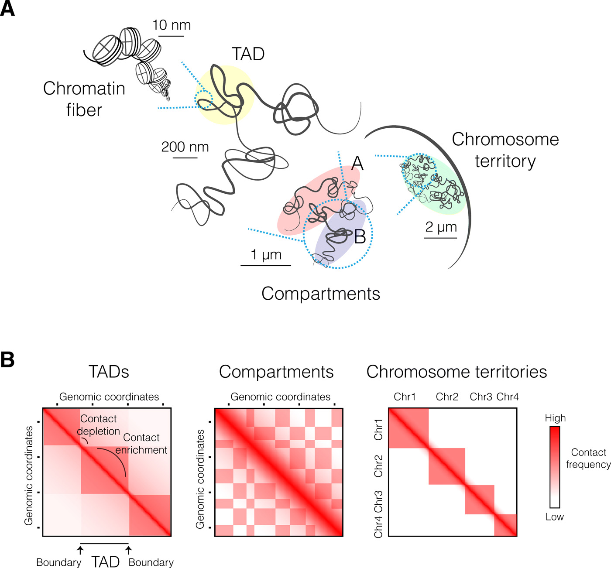
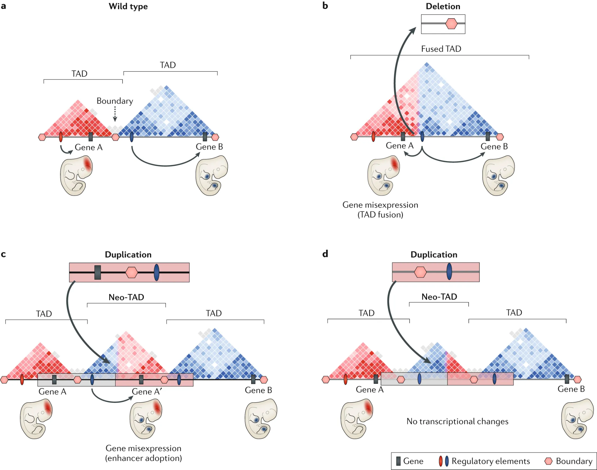

Topologically Associating Domains
=================================

The spatio-temporal organization of the DNA inside the nucleus is tightly linked to processes such as DNA-transcription and DNA-translation. Genes located in the interior of the nucleus are often more actively transcribed than genes located at the exterior of the nucleus :cite:`b-bickmore2013spatial`. Chromatin conformation capture (especially the high-throughput method Hi-C) have revealed further patterns in the chromatin structure of the genome :cite:`b-bonev2016organization`. Currently established models suggest that nuclear chromatin folding is arranged in several discrete rather than continuous domains. At a larger scale these domains have been described as A- and B-compartments :cite:`b-lieberman2009comprehensive`. A-compartments are gene rich and generally enriched for active chromatin while B-compartments are enriched in repressive chromatin. Our capability to detect chromatin structure compartmentalization depends on the resolution of the chromatin conformation capture experiments. At higher resolutions smaller domains have been identified which are often referred to as topologically associating domains (TADs) :cite:`b-dixon2012topological`. The Hi-C experiments show an increase in intra-TAD interactions compared to inter-TAD interaction frequencies. TADs have been identified in a wide range of species, suggesting that they are likely to be a conserved regulatory structure in mammals :cite:`b-szabo2019principles`. Especially, since gene coregultation during cell differentiation has been observed to be increased inside TADs rather than across TADs :cite:`b-nora2012spatial` and the boundaries of TADs are highly correlated with the boundaries of replication domains. 

   **A** Chromatin is organized on multiple structural levels. The smallest organizational unit are nucleosomes which can form units of increased spatial interaction also referred to as TADs. TADs can be part of either A- or B- compartments which in turn are part of single chromosomes that occupy a specific area inside of the nucleus called chromosome territory. **B** Overview of Hi-C experiments and the structural separation into unit of increased interaction frequencies. The results of an Hi-C experiment can be visualized in a matrix where the x- and y-axis correspond to genomic locations and the color code inside of the matrix represents the interaction or contact frequency. Regions of high interaction (TADs) are separated by smaller regions of contact depletion (TAD boundaries). The contact frequencies show patterns of interaction including multiple regions of high interaction frequency. The groups forming exclusive patterns of contact frequency are A- and B-compartments. Finally, the inter-chromosomal interactions are far less then intra-chromosomal interactions. Graphics adapted from from Szabo et al. :cite:`b-szabo2019principles`.

The first instances of TADs were based on domains with an average interval size in the hundreds of kilobases :cite:`b-dixon2012topological`. However, Hi-C with increased resolution found smaller sub-domains inside of TADs enriched with specific chromatin marks :cite:`b-rao20143d`. The boundaries of both TADs and smaller domains in mammals are highly correlated with binding sites for the protein CTCF in combination with the structural maintenance of chromosomes (SMC) cohesin complex :cite:`b-dixon2012topological`. These structures suggest that many TADs are loops in the 3D-structure of the genome. Some experiments showed that removing the binding site of CTCF was enough to destroy the TAD structure, indicating the important role of CTCF in the formation of regulatory domains :cite:`b-lupianez2016breaking`.  However, the combination of CTCF and the SMC cohesin complex do not seem to be the only process regulating the formation of TADs. One experiment revealed, that in the absence of cohesin TADs still exist but the position of their boundaries is no longer coherent with those of other cells, suggesting that cohesin is responsible for the positioning of the TADs. CTCF binding sites can also be found inside of TADs structures at enhancer-promotor pairs :cite:`b-rao20143d`.

In conclusion, TADs can differ in size and highly depend on the resolution of the Hi-C experiment, the method used to identify TAD boundaries and the processes underlying the formation of the TAD :cite:`b-dali2017critical`.TADs have been shown to function as regulatory units, since contacts between promotors and enhancer are often restricted within them. The disruption of TAD boundaries can therefore lead to interactions between enhancers and promotors of genes that change the expression of the genes and result in disease :cite:`b-lupianez2016breaking`. In figure a selection of scenarios are shown which can occur if a CNV hits a TAD boundary. The regulatory changes induced by CNVs hitting TAD boundaries are an important contributing factor to the quantification of their functional impact. I therefore included TAD boundaries as functional annotation in the enrichment analysis and the classification of pathogenic and non-pathogenic CNVs. It is important to note that I only determine if the variant is hitting the TAD boundary without analyzing the resulting regulatory changes. 

   **a** Schematics of the wild type of two neighbouring TADs. The first TAD contains a cis-regulatory element controlling the brain-specific expression of gene A. The second TAD also contains a cis-regulatory element which regulates the limb-specific expression of gene B. **b** A deletion hit the TAD boundary between the first and second TAD, resulting in a so called fusion-TAD. The cis regulatory element of the second TAD can now also regulate the expression of Gene A resulting in disease. **c** A duplication hitting gene A, the TAD boundary and the cis-regulatory element of the second TAD cause the formation of a new TAD or neo-TAD. In the neo-TAD the regulation of gene A is again regulated by the regulatory element in the second TAD which leads to disease. **d** In this scenario a duplication hit the TAD boundary and the cis-regulatory element of the second TAD. Even though this leads to the formation of a neo-TAD, there are no transcriptional changes and therefore the duplication does not result in disease. This figure is adapted from Lupianez et al. :cite:`b-lupianez2016breaking`

.. bibliography:: references.bib
   :style: plain
   :labelprefix: B
   :keyprefix: b-
